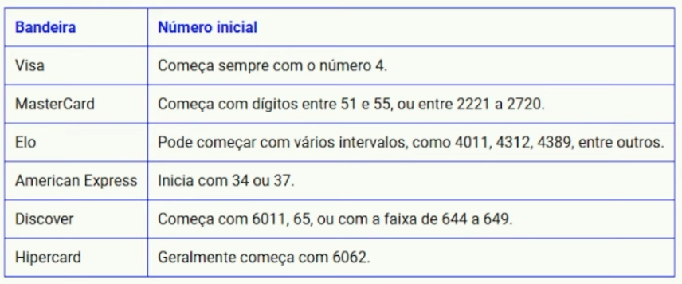

# validador_cartao_bandeira
Criando um Validador de Bandeiras de Cartão de Crédito com o GitHub Copilot

- Inputando um número de um cartão de crédito, validar qual a bandeira daquele cartão



---

# Validador de Bandeiras de Cartão de Crédito

Este projeto é um validador de bandeiras de cartão de crédito que identifica a bandeira (Visa, Mastercard, etc.) com base nos primeiros dígitos do número do cartão. Utilizamos o GitHub Copilot para agilizar o desenvolvimento, oferecendo sugestões inteligentes e código gerado automaticamente em JavaScript.

## Passo a Passo para Criar o Validador com GitHub Copilot

### 1. **Configuração Inicial do Ambiente**
- **Analogia**: Pense nisso como preparar o solo para um jardim estelar – um espaço pronto para florescer com código.
- **Ação**: Instale o Visual Studio Code e a extensão GitHub Copilot. Configure um ambiente Node.js (instale com `npm init -y` em um diretório e crie um arquivo `index.js`).
- **Dica do Copilot**: Ao abrir o VS Code, o Copilot sugerirá criar `index.js` – aceite digitando `index.js` e pressionando Enter.

### 2. **Criação do Projeto no GitHub**
- **Analogia**: Como lançar uma estrela no céu do repositório.
- **Ação**: Crie um novo repositório no GitHub. Inicialize localmente com `git init`, adicione arquivos com `git add .`, faça o primeiro commit com `git commit -m "Inicializando projeto"`, e envie com `git remote add origin <URL>` e `git push -u origin main`.
- **Dica do Copilot**: Ao digitar `git`, o Copilot pode sugerir comandos completos – use isso para agilizar.

### 3. **Definição das Regras de Validação**
- **Analogia**: Como estudar as constelações – cada bandeira tem um padrão único.
- **Ação**: Pesquise os padrões (ex.: Visa começa com 4, Mastercard com 51-55). No `index.js`, comece com `function validateCard(cardNumber) {` e deixe o Copilot sugerir a estrutura.
- **Dica do Copilot**: Comente `# Verifica se é Visa` e o Copilot pode sugerir `if (cardNumber.startsWith('4')) return "Visa";`.

### 4. **Implementação da Lógica com Copilot**
- **Analogia**: Como um guia estelar que ilumina o caminho.
- **Ação**: No `index.js`, adicione a lógica:
  - Use `cardNumber = cardNumber.replace(/\s/g, '')` para remover espaços.
  - Adicione condicionais como `if (['51', '52', '53', '54', '55'].includes(cardNumber.slice(0, 2))) return "Mastercard";`.
  - Deixe o Copilot sugerir `else if` para outras bandeiras (Amex, Discover, etc.).
- **Dica do Copilot**: Aceite sugestões com Tab e ajuste manualmente se preciso.

### 5. **Testes e Depuração**
- **Analogia**: Como meditar para alinhar as estrelas e corrigir órbitas.
- **Ação**: Crie um arquivo `test.js` com testes usando uma biblioteca como `assert` (instale com `npm install assert`). Exemplo:
  - `assert.strictEqual(validateCard("4123456789012"), "Visa");`.
  - Comente `# Teste para Visa` e deixe o Copilot gerar testes.
  - Execute com `node test.js`.
- **Dica do Copilot**: Peça casos de borda com `# Teste inválido` para sugestões.

### 6. **Documentação e Commit**
- **Analogia**: Como gravar constelações em um mapa eterno.
- **Ação**: Atualize este README.md com detalhes. Adicione comentários no código (ex.: `// Valida número de cartão`). Faça commit com `git commit -m "Adiciona validação e testes"`.
- **Dica do Copilot**: Comente `# Descrição do projeto` no README.md e aceite sugestões.

### 7. **Publicação e Uso**
- **Analogia**: Como compartilhar o brilho das estrelas com o universo.
- **Ação**: Publique no GitHub com `git push`. Adicione um script no `index.js`:
  ```javascript
  const card = prompt("Digite o número do cartão: ");
  console.log(validateCard(card));
  ```
- **Dica do Copilot**: Comente `# Menu interativo` para sugestões de entrada.

## Requisitos
- Node.js instalado
- GitHub Copilot (extensão no VS Code)
- Git instalado

## Contribuições
Contribuições são bem-vindas! Adicione novas bandeiras ou melhore a lógica.

---
